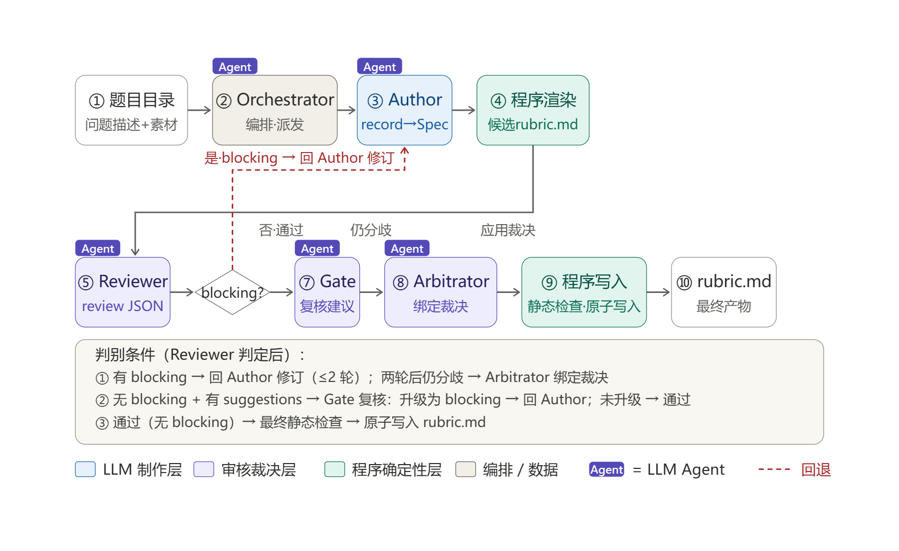

# Rubric Generator v1.0

面向 AI Agent 测评数据集的题目级 Rubric 生成器。输入目录中的每道题由 `问题描述.txt` 和可选源素材组成；成功后仅把 `rubric.md` 写回题目目录，完整制作、审核、修订和裁决留痕保存在项目的 `.rubric-generator/runs/`。

## 输出接口

每道题的 Rubric 固定输出：

- 任务完成率：`0.00%—100.00%`
- 内容覆盖度：`0.00—5.00`
- 准确率·忠实度：`0.00—5.00`
- 格式合规度：`0.00—5.00`
- 结构完整度：`0.00—5.00`
- 幻觉／自洽性：`0.00—5.00`

它不生成单一的 0—100 综合总分。上述名称和量程固定，但每项具体原子、权重、事实锚点、状态函数和错误规则均由题目及源素材决定，不会强行套用同维度或同题型模板。

## 工作流



流程图用于概览。实际编排由 Python 程序执行，默认最多一轮定向修改；Gate 与裁决的触发条件见下文。

1. Author 对单题执行“解题式审题”，形成内部 `authoring record`。
2. Author 根据该记录生成结构化 `Rubric Spec`，不自由编排 Markdown。
3. 程序检查 ID、六组权重、状态函数、真实输入路径及 record/spec 对齐，然后确定性渲染候选 `rubric.md`。
4. Reviewer 独立核查题意、锚点、可计算性、开放答案公平性和自包含性。
5. Reviewer 已判定通过但仍有 suggestions 时，独立 Classification Gate 才复核其严重性；只有存在具体、可复现评分后果的项目才提升为 blocking。
6. 最多一轮定向修改；仍有阻断分歧时由 Arbitrator 作一次绑定裁决。裁决后只生成并应用最小 JSON Patch，不重新输出整份大型 record/spec。
7. 每个通过机器校验的阶段立即保存为检查点；通过最终静态检查后原子写入题目目录，中间文件留在项目运行目录。

Reviewer 只报告会造成错误评分或无法可靠执行的问题。措辞、排版偏好和“为了更完整”的新增要求不能成为阻断项。

数值规则遵守题面规定的精度；未规定精度时，制作与审核角色核查足以支持任务结论的合法舍入，避免任意固定绝对误差暗中增加小数位数要求。建议分类门禁也以具体舍入反例判断是否会误罚，不会仅因某个容差可计算便忽略错误评分。

最终 `rubric.md` 始终由结构化 Rubric Spec 确定性渲染，因此章节顺序、编号、六项结果接口和评分表结构保持一致。中间结构中的同义措辞或可自动规范化差异不会触发整份 Rubric 重写；权重、状态函数、来源、自包含性和可计算性仍是硬约束。

## 安装

需要 Python 3.11+、[uv](https://docs.astral.sh/uv/) 和 OpenCode。进入项目目录后运行：

```bash
cd /d/mywork/rubric-generator-v1.0
uv sync
```

统计分析类题目可安装可选复算依赖：`uv sync --extra analysis`。这会提供 NumPy、SciPy 和 pandas，用于从源素材核验统计检验、相关系数等客观锚点；普通题目的默认安装不变。

仓库提供 `opencode.example.jsonc`，其中配置了 AI·AAA 的 OpenAI 兼容端点。首次使用时复制为被 Git 忽略的本机配置：

```bash
cp opencode.example.jsonc opencode.jsonc
```

生成器会优先保留进程环境变量，并在变量不存在时自动读取项目根目录中被 Git 忽略的 `.env`：

```bash
AIAAA_API_KEY=sk-你的密钥
```

也可以只在当前终端设置：

```bash
export AIAAA_API_KEY="sk-你的密钥"
```

八个 Agent（含轻量运行时兼容性检查和 JSON 语法修复角色）默认均使用 `aiaaa/deepseek-v4.1-flash#high`。最终补丁 Agent 只接收已校验产物与绑定裁决；制作、修订和审核阶段由程序直接传入已掌握的本地输入，避免模型重复加载 Skill或读取同一文件。每个角色可在 `rubric-generator.toml` 中分别修改模型。Agent frontmatter 的温度均为 `0.1`。

每次生成或续跑开始前，程序会执行一次很小的工具续写检查。如果中转站不能在工具返回后继续生成，程序会在启动题目之前安全停止，不会把整批任务逐题跑成失败。模型调用中的不完整 HTTP 错误只进行有限重试；已经输出完整标记结果的调用仍会进入正常校验。

如果长时间调用已经输出完整 BEGIN/END 标记，但上游流中断在 JSON 内留下局部截断或重复残片，程序会优先调用无工具的 JSON 修复角色，只修语法并复用既有研究结果，不会从头执行整道题。

## 运行

为整个数据集生成，最多同时处理三道题：

```bash
uv run rubric-generator generate \
  --dataset "D:/path/to/测试数据集" \
  --concurrency 3
```

筛选部分题目：

```bash
uv run rubric-generator generate \
  --dataset "D:/path/to/测试数据集" \
  --task-pattern "维度一" \
  --limit 2 \
  --concurrency 2
```

只生成当前尚无 `rubric.md` 的题目（续跑时会保留相同 run ID 下的有效检查点）：

```bash
uv run rubric-generator resume \
  --dataset "D:/path/to/测试数据集" \
  --run-id "已有运行ID" \
  --missing-only \
  --concurrency 3
```

默认跳过已有 `rubric.md`。确认需要重做时加 `--force`；原版本会备份到当次运行留痕中。

某次运行中断或后期校验失败时，可用原 run ID 从已校验检查点继续。已经完成的审题、规格、审核、修改和裁决不会再次调用模型：

若修正了审核角色的规则，需要重新审查失败题，可在 `resume` 中加 `--refresh-reviews` 并限定 `--task-pattern`。程序将旧审核及其下游修改、裁决、补丁留痕归档到对应任务的 `artifacts/review-refresh/`，重新执行这些阶段；已校验的初始审题与初始规格检查点仍复用，避免拿旧修改稿回答新的阻断意见。默认续跑继续复用有效检查点；被结构或一致性校验拒绝的响应会归档到 `artifacts/rejected-resume/`，仅重新生成失败阶段，并携带具体诊断，不反复重用同一无效响应。候选规格及补丁应用结果先通过结构与一致性校验，再进入 Markdown 渲染，缺少必需字段会触发有限纠错，不会直接因渲染字段缺失中止。

```bash
uv run rubric-generator resume \
  --dataset "D:/path/to/测试数据集" \
  --run-id "20260922-174236" \
  --task-pattern "1_AI_Agent产品对比研究" \
  --concurrency 1
```

只读审计已有 Rubric：

```bash
uv run rubric-generator audit --dataset "D:/path/to/测试数据集"
```

审计不会修改文件。已有 Rubric 可用时直接报告 `USABLE`；只有确定的结构阻断才报告 `BLOCKING`，启发式观察只显示为 `ADVISORY`。

隔离回归不会修改参考数据集：

```bash
uv run rubric-generator regression \
  --source "D:/path/to/参考数据集" \
  --limit 1 \
  --concurrency 1
```

## 文件边界

- 数据集题目目录：原有 `问题描述.txt`、原有源素材、最终 `rubric.md`。
- `.rubric-generator/runs/<run-id>/`：输入快照、素材提取、authoring record、Rubric Spec、审核、裁决、模型事件及状态。
- `regression/runs/`：隔离回归副本与比较结果。

最终 Rubric 只能引用题目目录中真实存在且会随数据集打包的文件，或题目允许使用的实时外部来源。它不能依赖 `material-manifest.json`、authoring record、审核记录或项目内部路径。

实时或外部来源以结构化表格写入 Rubric：每条来源独立记录发布方、标题、日期/版本、支持内容、完整 HTTPS 链接、核验状态和备用证据。裸域名、占位地址、猜测 URL，以及无备用证据却支撑关键锚点的不可访问页面会被阻止。

## 离线测试

测试使用假模型响应，不调用 ClawCn，也不会产生费用：

```bash
uv run python -m unittest discover -s tests -v
```

`opencode.jsonc` 与运行产物已被 `.gitignore` 排除；可提交 `opencode.example.jsonc` 和 `rubric-generator.toml`，供其他使用者配置自己的密钥和模型。

### OpenCode CLI 兼容配置

默认沿用 OpenCode 2.x 的 `--standalone` 调用。若中转接口不支持该版本的请求字段，可在本地 `.env` 中设置 `OPENCODE_BIN` 为已安装的 OpenCode 1.x 原生可执行文件，并设置 `OPENCODE_RUN_MODE=legacy`。兼容模式会将模型配置中的 `#high` 转为 `--variant high`，并使用该版本支持的命令参数；模型与判别流程不变。运行前仍须通过真实工具续写探针。长提示使用附件，附件与消息之间显式分隔，避免 CLI 将消息误当作文件路径。

常规能力测试数据集仅包含问题描述、源素材和生成的 rubric；交付文件与历史评分不作为生成输入，整个数据集目录已加入 Git 忽略规则。

兼容模式的会话数据库、缓存和全局配置隔离在 `.rubric-generator/opencode-legacy/`，不修改系统 OpenCode 的已有状态。OpenCode 1.x 需要 `provider` / `npm` / `options` 形式的本地配置（可参考本项目 `opencode.v1.example.jsonc`）；2.x 则使用原有 `providers` / `package` / `settings`。角色使用 `mode: all`，允许程序直接调用，同时保留子角色调用能力，避免 1.x 把指定角色替换为默认编排角色。

结构化候选的规范化只修复不改变评分含义的表达问题。例如，已验证记录明确规定固定正分母、候选原子规则与其完全一致时，会移除不可达空集合的冗余说明；可变分母、实际空集合策略及评分规则冲突仍由审计阻止。每次规范化保留修改记录，最终 rubric 仍须通过独立审核和计算性审计。

接口超时或明确报告输出长度上限时，在有剩余重试次数且可取得会话 ID 的情况下，程序复用已完成的工具核验；截断输出会要求重新返回精简、完整的阶段结果，不拼接残缺 JSON。若超时前已获得完整标记结果，则继续正常内容校验。脱敏事件保存在 `.rubric-generator/call-diagnostics/`，失败题目可通过 `resume --missing-only` 恢复，已完成 rubric 不重跑。

若模型只返回单个完整合法 JSON 对象而遗漏外层标记，程序允许继续校验；残缺标记、夹杂说明、多个对象仍触发重试。公开源码核验允许作者和审核角色读取本题 scratch 副本中的环境示例文件，兼容新旧 CLI 路径匹配；项目自身 `.env` 等真实配置仍保持禁止读取。

Rubric Spec 的纠错提示内联被拒绝的 JSON，与该阶段禁止读取额外路径的规则一致；错误响应和纠错事件仍完整留痕。来源状态只接受已核验、访问受限、暂时不可用三种明确定义，不能把未知状态自动认定为已核验。

时间敏感题目的评分规则与锚点应按被评任务的实际执行记录或披露截止日期适用。生成 rubric 时的访问日期用于标记参考证据，不能据此认定历史交付的日期、价格或版本错误；制作、审核、分类与裁决角色共同检查这一边界。
